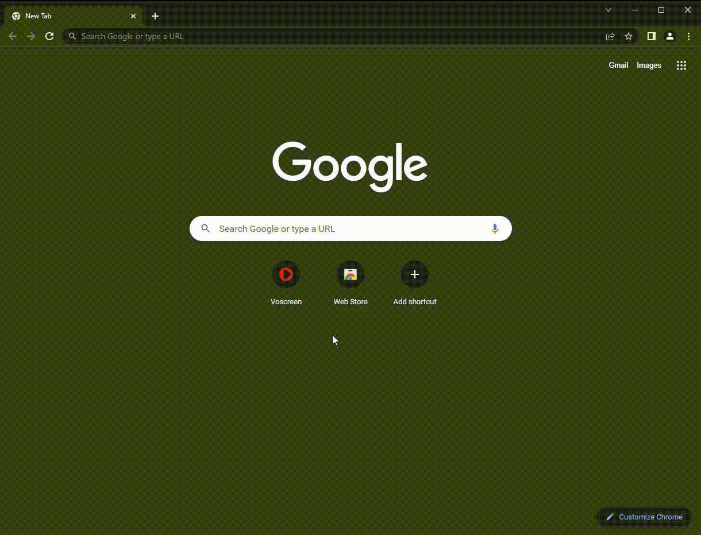

# Voscreen Shortcuts Extension

This is a browser extension that adds keyboard shortcuts to Voscreen. With this extension, you can quickly navigate through Voscreen's interface without having to use your mouse.

---

## Installation

More tools > Extensions > Developer Mode(On) > Load unpacked > Find extension folder > Done !

You can download the file from here and follow the installation by looking at the GIF image."

## Usage

The extension adds the following keyboard shortcuts to Voscreen:

- <kbd>↓</kbd>: Play, pause, replay the current video
- <kbd>↑</kbd>: Jump to the next video
- <kbd>←</kbd>: Click left box
- <kbd>→</kbd>: Click right box

"The usage is demonstrated in the GIF image."

## License

This project is licensed under the [MIT License](./LICENSE).
